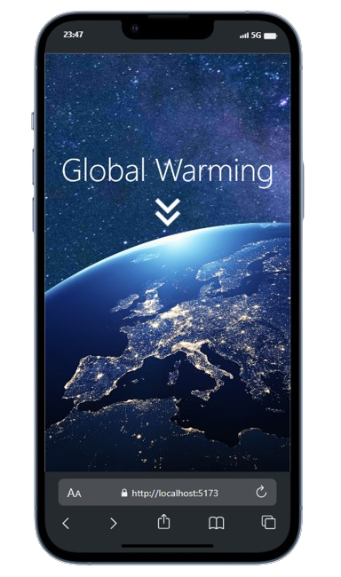
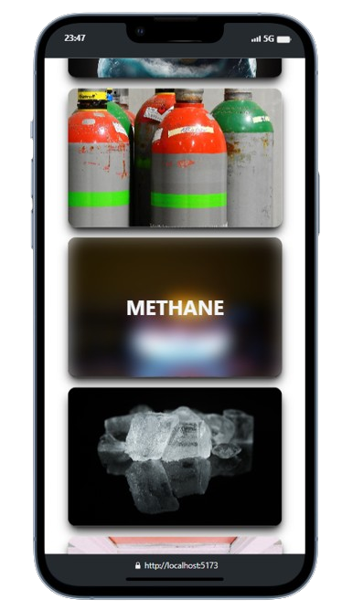
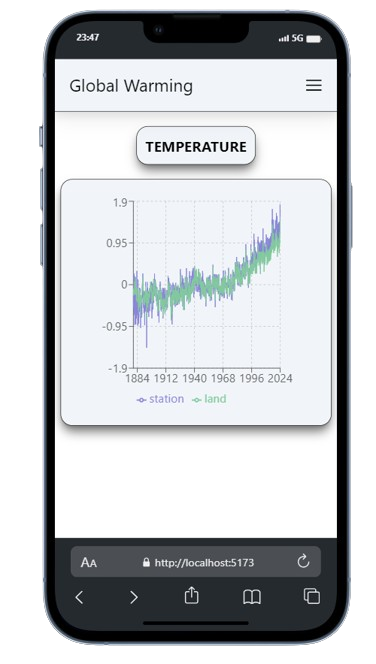

# Global warming tracker

<div style="display: flex; justify-content: space-between;">
   
   
   
</div>

## Explanation

"Mobile-First Climate Change Awareness App"

This innovative mobile application offers concise tables on various climate change topics, optimized for mobile viewing. Designed to educate and engage users, it presents data on rising temperatures, melting ice, changing weather patterns, and more. Interactive features and visualizations enhance understanding, making complex information accessible. Aimed at a broad audience, the app encourages informed discussions and collective action on urgent climate challenges.

## Installation

To run Food-Footprint on your local machine, follow these steps:

1. Clone the repository using:
   ```bash
   git clone https://github.com/TonyLig/Global-warming-tracker.git
   ```
2. Install the required dependencies with:

   ```bash
   npm install
   ```

3. Start the application with:

   ```bash
   npm start
   ```

## Live Demo

Check out the live demo of Mindful at: [Global warming tracker](https://global-warming-tracker.vercel.app/)

## Technologies Used

- 
- 
- 
- 
- 

# Technologies Overview

This application is crafted with a strong focus on robustness, organized state management, and enhanced performance. The key technologies chosen for achieving these goals are TypeScript, Redux, and Tailwind.

## TypeScript for a Robust Codebase

I've opted for TypeScript to ensure a solid and reliable codebase. TypeScript introduces static typing, catching potential errors during development and providing a more maintainable and scalable code structure. This decision contributes to the overall stability of the application.

## Redux for State Management

For organized and predictable state management, I've integrated Redux. By centralizing the state and actions, Redux facilitates a clear and structured flow of data within the application. This approach ensures a seamless user experience and simplifies debugging and testing processes.

## Tailwind for its efficiency and flexibility

I chose Tailwind for its efficiency and flexibility. Its utility-first approach streamlined development, while built-in responsiveness ensured a consistent user experience across devices. This allowed for quicker iterations and a more maintainable codebase.

## Vite for its fast development environment

I used Vite in my project for its fast development environment and built-in features like hot module replacement. Vite's performance optimizations and intuitive configuration made it easier to set up and maintain my application, resulting in a smoother development experience.
